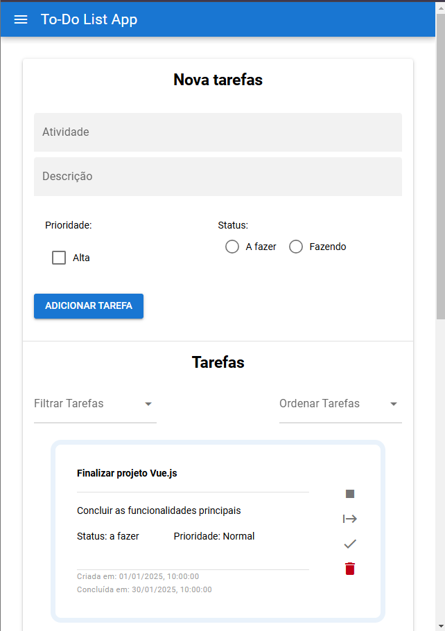
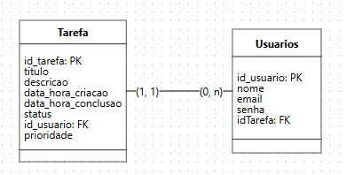

# TodoList (Frontend)
<div style="display: flex; padding: 5px;">

<div style="padding: 20px"> 
<h3> Este é um aplicativo de lista de tarefas desenvolvido com Vue.js utilizando o framework Quasar e a Component API. 
<br/> <br/>

O objetivo é criar, visualizar, atualizar e excluir tarefas, com funcionalidades como filtros e ordenação. 
</div>
</div>

## Funcionalidades

### 1. **Adicionar Tarefas**
- Permite criar tarefas com os seguintes campos:
  - **Título**: Nome da tarefa.
  - **Descrição**: Detalhes adicionais sobre a tarefa.
  - **Data e Hora de Criação**: Registrados automaticamente.
  - **Data e Hora de Conclusão** (opcional): Adicionado quando o status da tarefa é atualizado para "concluído".
  - **Status**: Pode ser "a fazer", "feito" ou "concluído".

### 2. **Visualizar Tarefas**
- Exibe a lista de tarefas com as seguintes opções:
  - **Filtrar por Status**: Exibe as tarefas agrupadas como "a fazer", "feito" ou "concluído".
  - **Filtros por alta prioridade**: Filtre tarefas se a prioridade for alta.
  - **Ordenação por Data ou por Nome**: Permite visualizar as tarefas em ordem de criação ou por ordem alfabética.
  
### 3. **Excluir Tarefas**
- Remova tarefas individuais da lista quando elas não forem mais necessárias.


## Tecnologias Utilizadas

- **Vue.js**: Framework progressivo para desenvolvimento de interfaces de usuário.
- **Quasar Framework**: Framework baseado em Vue para desenvolvimento de aplicações web e mobile.
- **Component API**: Abordagem moderna para trabalhar com componentes no Vue.js.

## Pré-requisitos

Certifique-se de ter instalado:
- [Node.js](https://nodejs.org/) (versão 16 ou superior recomendada)
- [Yarn](https://yarnpkg.com/) ou npm
- Quasar CLI (se ainda não estiver instalado, use o comando: `npm install -g @quasar/cli`)

## Como Configurar e Executar o Projeto

### 1. Instale as Dependências
No diretório do projeto, execute o comando abaixo para instalar as dependências necessárias:
```bash
yarn
# ou
npm install
```

### 2. Inicie o App no Modo de Desenvolvimento
Este comando inicia o servidor de desenvolvimento com recarregamento automático e relatórios de erro.
```bash
quasar dev
```

## Estrutura de Pastas do Projeto

```
src/
├── assets/          # Arquivos estáticos como imagens e estilos globais
├── components/      # Componentes reutilizáveis do Vue
├── layouts/         # Layouts globais usados pelo Quasar
├── pages/           # Páginas principais do aplicativo
├── router/          # Configuração de rotas
├── store/           # Gerenciamento de estado (Vuex ou Pinia)
└── App.vue          # Componente raiz
 ```


## Planejamento do Banco de Dados

### Modelo Entidade-Relacionamento (MER)


Este MER apresenta a modelagem de um banco de dados para uma aplicação de gerenciamento de tarefas (todo list) com funcionalidades para múltiplos usuários.

### Tabelas e Atributos

1. Tabela ` Usuarios` : 

- `id_usuario` (PK): Identificador único de cada usuário. Foi escolhido como chave primária para garantir que cada usuário tenha um registro único no sistema.
- `nome`: Nome completo do usuário, para exibição em interfaces ou relatórios.
- `email`: Endereço de e-mail do usuário, utilizado para login ou comunicação.
- `senha`: Senha do usuário, necessária para autenticação e segurança.
- `idTarefa` (FK): Chave estrangeira que referencia a tabela Tarefa. Representa o vínculo de um usuário com as tarefas que ele criou.

Decisão: Essa tabela foi criada para gerenciar os dados dos usuários e estabelecer a relação entre usuários e suas tarefas. A relação de (0, n) entre `Usuarios` e `Tarefa` reflete que um usuário pode não ter tarefas ou pode ter várias.

2. Tabela `Tarefa`:
- `id_tarefa` (PK): Identificador único de cada tarefa. Serve para garantir que cada tarefa possa ser referenciada de forma única.
- `titulo`: Título curto e descritivo para a tarefa.
- `descricao`: Descrição detalhada da tarefa, permitindo incluir mais informações relevantes.
- `data_hora_criacao`: Data e hora em que a tarefa foi criada. Esse atributo é importante para rastrear e ordenar as tarefas.
- `data_hora_conclusao`: Data e hora em que a tarefa foi concluída. Opcional, permitindo identificar tarefas pendentes e concluídas.
- `status`: Status da tarefa, como "pendente" ou "concluída", utilizado para controle do progresso.
- `id_usuario` (FK): Chave estrangeira que referencia a tabela Usuarios. Essa associação indica qual usuário é o responsável por cada tarefa.
- `prioridade`: Nível de prioridade da tarefa, como "baixa", "média" ou "alta". Ajuda a organizar e priorizar tarefas.

Decisão: Essa tabela centraliza todas as informações sobre as tarefas. A relação de (1, 1) com a tabela Usuarios assegura que cada tarefa é obrigatoriamente vinculada a um único usuário, garantindo rastreabilidade.

### Relacionamento
Relação `Usuarios (1, 1) - (0, n) Tarefa`:
- Um usuário pode criar zero ou várias tarefas (relação 1 para N).
 - Cada tarefa é obrigatoriamente atribuída a um único usuário (relação N para 1).
- Isso garante que o sistema pode lidar com múltiplos usuários, cada um gerenciando suas próprias tarefas, sem sobreposição ou duplicação de dados.